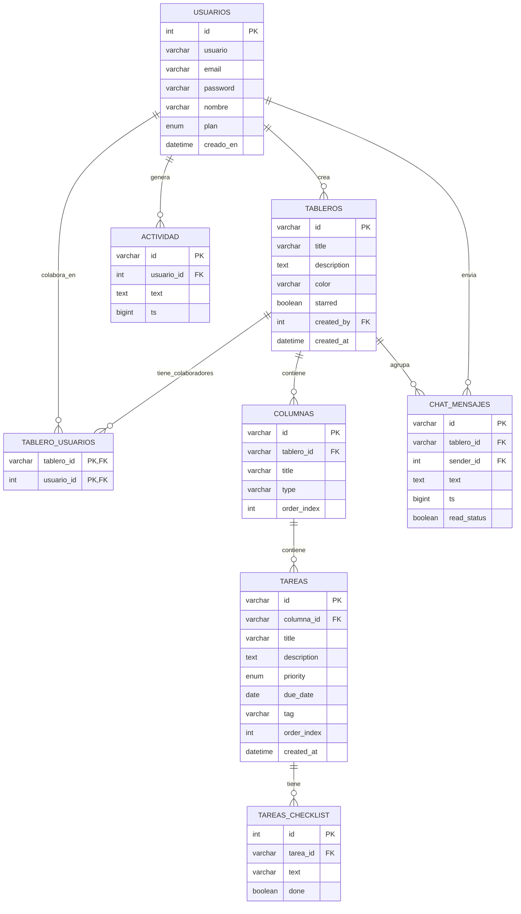

# Memoria del Trabajo de Fin de Grado: Planify

## Resumen Ejecutivo
Planify es una aplicación de gestión de tareas colaborativa inspirada en Kanban, diseñada para optimizar los flujos de trabajo de equipos. Inicialmente desarrollada con una aproximación de almacenamiento en el cliente (LocalStorage), la arquitectura ha sido evolucionada hacia un sistema robusto cliente-servidor, apoyado en PHP y MySQL para permitir concurrencia real y persistencia segura de la información.

## 1. Índice General
1. [Resumen Ejecutivo](#resumen-ejecutivo)
2. [Arquitectura del Sistema](#2-arquitectura-del-sistema)
3. [Modelo de Datos](#3-modelo-de-datos)
4. [Consideraciones de Seguridad y Colaboración](#4-consideraciones-de-seguridad-y-colaboración)
5. [Anexo Técnico](#5-anexo-técnico)

## 2. Índice de Ilustraciones
- **Figura 1.** Diagrama de Arquitectura de la Aplicación.
- **Figura 2.** Diagrama Entidad-Relación (ER) de la Base de Datos.

---

## 2. Arquitectura del Sistema

La arquitectura actual de Planify sigue el modelo Cliente-Servidor clásico (o arquitectura en dos capas principales desde la perspectiva lógica), utilizando un backend en PHP que expone endpoints tipo REST y un frontend puro en JavaScript, HTML5 y CSS3.

**Figura 1. Diagrama de Arquitectura de la Aplicación**

```mermaid
flowchart TD
    subgraph Cliente ["Capa de Presentación (Frontend)"]
        UI["Interfaz Web (HTML5, CSS3)"]
        JS["Lógica de Negocio JS (script.js)"]
        UI <--> JS
    end

    subgraph Servidor ["Capa de Lógica y Datos (Backend)"]
        API["API REST (PHP: auth, boards, chat)"]
        PDO["Abstracción de Datos (PDO)"]
        API <--> PDO
    end

    subgraph BD ["Capa de Persistencia"]
        MySQL[("MySQL (planify_db)")]
    end

    JS <-->|Fetch API (HTTP/JSON)| API
    PDO <-->|SQL Queries| MySQL
```

Este enfoque permite a la aplicación ser completamente colaborativa, solucionando la limitación del estado local en el navegador.

## 3. Modelo de Datos

Para soportar las capacidades multi-usuario y la integridad de la gestión de tableros, columnas, tareas y el chat de la plataforma, se ha diseñado una base de datos relacional.

**Figura 2. Diagrama Entidad-Relación (ER) de la Base de Datos**



## 4. Consideraciones de Seguridad y Colaboración

La migración a una base de datos relacional proporciona una base sólida para:
1. **Seguridad de credenciales**: Las contraseñas ahora son hasheadas con `password_hash()` en PHP en lugar de ser codificadas burdamente en el cliente (como se hacía anteriormente con `btoa()`).
2. **Concurrencia**: Al consumir y enviar datos de manera asíncrona mediante `fetch`, las actualizaciones y movimientos en el tablero Kanban se persistirán globalmente, logrando la colaboración multi-usuario esperada en el proyecto.

---

## 5. Anexo Técnico

En este anexo se adjuntan las piezas clave del código implementadas para el funcionamiento de la aplicación, separadas del discurso principal para no dificultar su lectura.

### 5.1. Conexión PDO a MySQL (`api/config.php`)

```php
<?php
$host = '127.0.0.1';
$db   = 'planify_db';
$user = 'root';
$pass = '';
$charset = 'utf8mb4';

$dsn = "mysql:host=$host;dbname=$db;charset=$charset";
$options = [
    PDO::ATTR_ERRMODE            => PDO::ERRMODE_EXCEPTION,
    PDO::ATTR_DEFAULT_FETCH_MODE => PDO::FETCH_ASSOC,
    PDO::ATTR_EMULATE_PREPARES   => false,
];

try {
     $pdo = new PDO($dsn, $user, $pass, $options);
} catch (\PDOException $e) {
     die(json_encode(["error" => "Database connection failed: " . $e->getMessage()]));
}
?>
```

### 5.2. Asincronismo Frontend (Extracto de `script.js`)

Se ha sustituido la gestión directa en LocalStorage por peticiones al backend:

```javascript
const DB = {
    getBoards: async (uid) => {
        const res = await fetch(`api/boards.php?action=get&userId=${uid}`);
        const data = await res.json();
        return data.success ? data.boards : [];
    },
    saveBoards: async (uid, boards) => {
        await fetch(`api/boards.php?action=save&userId=${uid}`, {
            method: 'POST',
            headers: {'Content-Type': 'application/json'},
            body: JSON.stringify({ boards })
        });
    }
};
```
