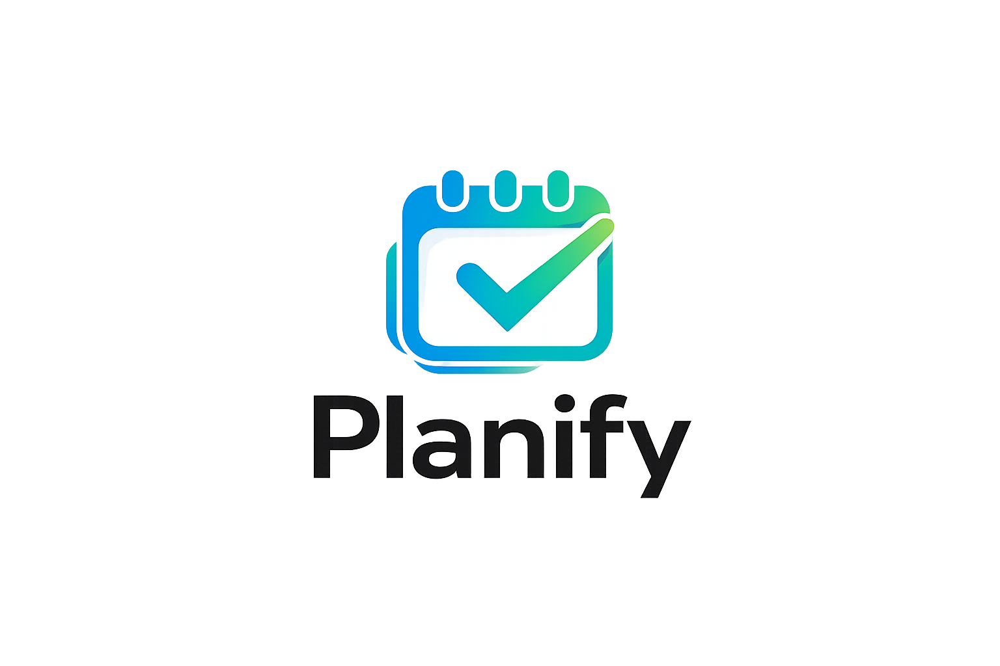

<div align="center">
  
  <h1>Planify</h1>
  <p><em>Gestión de Proyectos, Productividad y Colaboración (Trabajo de Fin de Grado)</em></p>
</div>

---

## 📖 Descripción del Proyecto

**Planify** es una plataforma de gestión de tareas colaborativa basada en la metodología Kanban. Diseñada como proyecto para nuestro Trabajo de Fin de Grado, la aplicación facilita la coordinación de equipos permitiendo crear tableros, columnas personalizables, listas de comprobación (checklists) y mantener una comunicación directa mediante un chat integrado.

Originalmente planteada como una aplicación offline mediante almacenamiento en `LocalStorage`, ha sido evolucionada hacia una robusta arquitectura cliente-servidor con sincronización en tiempo real a través de PHP y MySQL, permitiendo una experiencia multiusuario y colaborativa completa.

## ✨ Características Principales

- 🔐 **Autenticación Segura**: Sistema de login y registro de usuarios con encriptación de contraseñas.
- 📋 **Tableros Kanban**: Creación y organización de flujos de trabajo mediante tableros y columnas personalizadas.
- ✅ **Gestión Detallada de Tareas**: Tareas con prioridad, fechas de vencimiento, etiquetas y barras de progreso para checklists.
- 💬 **Chat de Equipo Integrado**: Comunicación por sala de chat independiente para cada tablero.
- 📊 **Registro de Actividad**: Historial de las acciones realizadas por cada usuario.
- 🎨 **Diseño Moderno e Intuitivo**: Interfaz responsive y fluida usando HTML5, CSS3 y Vanilla JavaScript sin necesidad de frameworks pesados.

## 🛠️ Stack Tecnológico

**Frontend:**
- HTML5 & CSS3
- Vanilla JavaScript (ES6+)
- API Fetch para solicitudes asíncronas
- [Boxicons](https://boxicons.com/) para iconografía

**Backend:**
- PHP 8.x
- PDO (PHP Data Objects)
- Arquitectura basada en API REST

**Base de Datos:**
- MySQL (Esquema relacional)

## 🚀 Instalación y Puesta en Marcha

Sigue estos pasos para desplegar Planify en tu entorno local:

1. **Requisitos Previos**:
   Asegúrate de tener instalado un servidor local como **XAMPP**, **MAMP** o **WAMP**.

2. **Clonar el Repositorio**:
   ```bash
   git clone https://github.com/yosuax/Planify.git
   ```

3. **Ubicar los Archivos**:
   Mueve el contenido de la carpeta `Planify-main` a la carpeta raíz de tu servidor web (por ejemplo, `htdocs` en XAMPP o `www` en WAMP).

4. **Configuración de la Base de Datos**:
   - Abre **phpMyAdmin** (generalmente en `http://localhost/phpmyadmin`).
   - Crea una nueva base de datos llamada `planify_db`.
   - Importa el archivo `Trabajo_TFG_Final/planify_db.sql` incluido en este repositorio.

5. **Configuración del Backend**:
   Asegúrate de que tus credenciales de base de datos coinciden con las de `Trabajo_TFG_Final/api/config.php` (por defecto usa el usuario `root` sin contraseña).

6. **Ejecutar la Aplicación**:
   Abre tu navegador web y visita:
   ```
   http://localhost/Planify-main/Trabajo_TFG_Final/index.html
   ```

## 📚 Documentación Formal
Toda la documentación relacionada al Trabajo de Fin de Grado, incluyendo Diagramas Entidad-Relación y Arquitectura del Sistema, se encuentran disponibles en el archivo [`Memoria_TFG.md`](./Memoria_TFG.md).

## 🧑‍💻 Autores
- **Yosuax** - [GitHub](https://github.com/yosuax)
- **Antonio Tirado** - [GitHub] (https://github.com/antoniotiradog05)
- **Fernando**
- **Pablo** 

---
<p align="center">Desarrollado para el TFG.</p>
